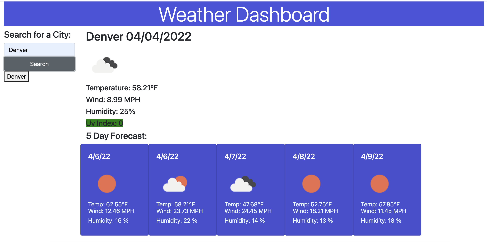

# weather_dashboard
This is a weather dashboard that gives you current information for any city that you search. Just put in your city in the search bar and click search and the current weather, as well as the next 5 days of weather will show up.

## Screen-Shot

## Project Features
This project has the following features:
<ul>
<li> When the page is opened you have a search bar but no weather information on the page </li>
<li> Type in the city of the where you want to recieve weather information for and click search</li>
<li> The search button will then open the information in the boxes next to it with the top being the current weather for that location and below is the next 5 day weather forcast for the same city </li>

</ul>

## Links to Application

<a href="https://github.com/smturner/weather_dashboard">GitHub link </a>

<a href="https://smturner.github.io/weather_dashboard/">Deployed Application </a>